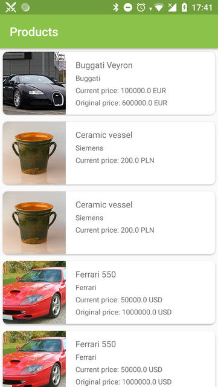

# Marketplace
Development of a small application, which is a demo version of the trading platform

Main technologies: **Kotlin, MVP, Room, Retrofit, RxJava2, Dagger2, Mockito, Espresso**

# Short app description
The application consists of 2 main screens.

1) **Splash Activity** - activity for solving the problem of blank white page at the start of the app and loading list of products during the first run.

2) **Products Activity** - a screen containing a list of products

 

In the application you can find Unit (use cases and presenters) and UI tests. For zooming I used third party library jsibbold:zoomage (zoomed ImageView).

In the process I had one problem, although it will be more correct to say misunderstanding. In the task you can see 2 points:
1) The products are shown in a scrolling list, sorted by name.
2) The list can be filtered by product name.

Unfortunately I did not understand the difference, so the list is sorted by name without the support of additional sorts. However, I would like to note that the list is sorted using the Comparator class. This allows you to add new sorting types without any problems, add new Comparator and switcher as member of menu.
